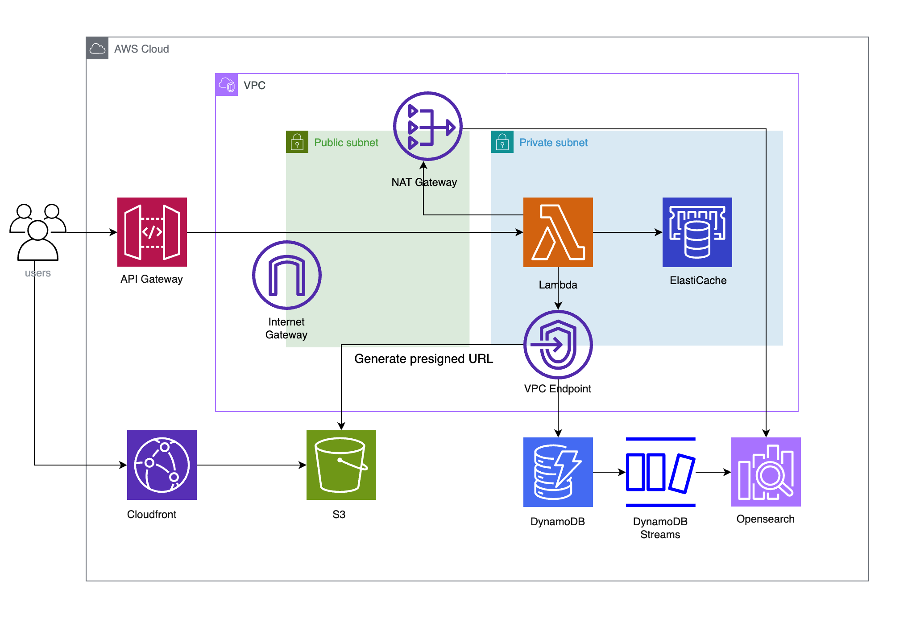
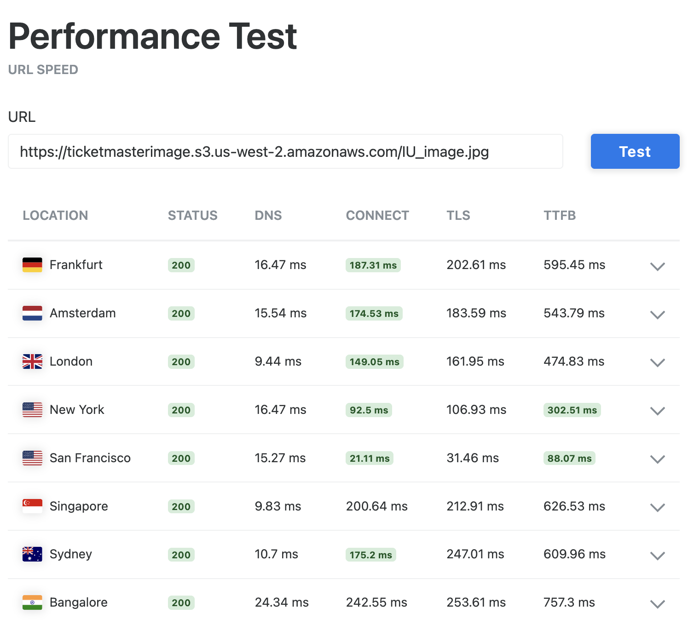
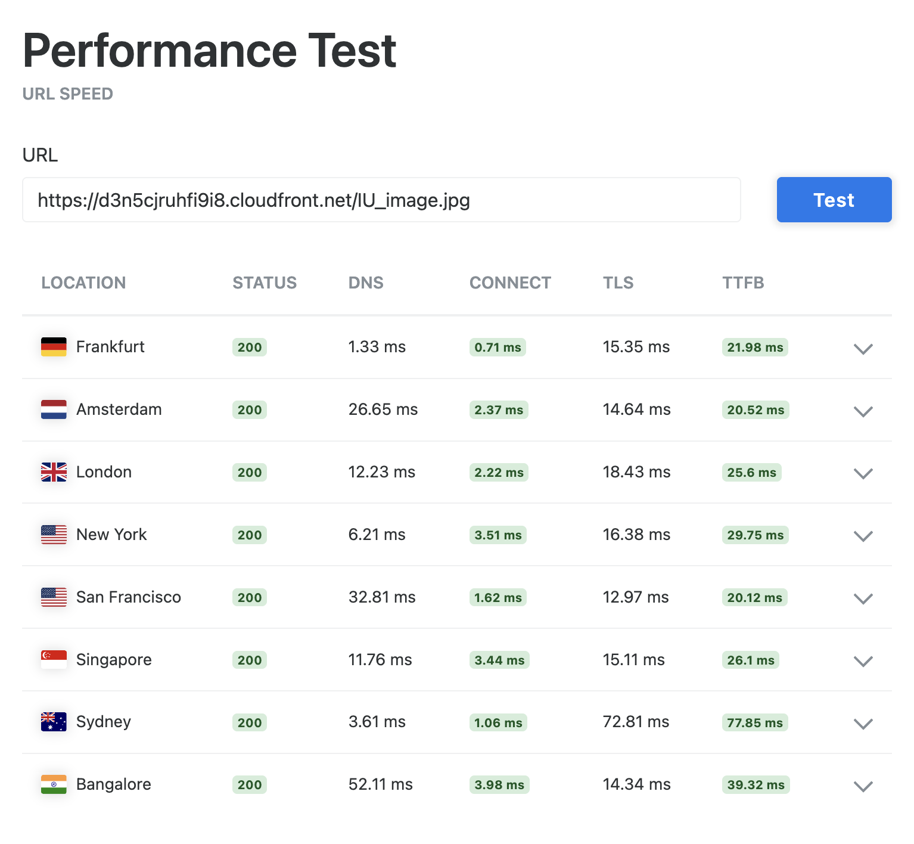

# K-ConcertBook

## Architecture Overview

K-ConcertBook is a **serverless, high-concurrency ticket booking system** designed for K-pop concert reservations.  
The primary goal of this architecture is to **handle large-scale concurrent traffic while maintaining strong data consistency, low latency, and high availability**.

The system is built entirely on **AWS managed services**, minimizing operational overhead while ensuring scalability, security, and fault tolerance.

---

## High-Level Architecture

- **API Gateway** serves as the entry point for all client requests
- **AWS Lambda** handles business logic in a fully serverless environment
- **DynamoDB** stores ticket, event, and booking data
- **Redis** is used as a distributed lock to prevent race conditions during concurrent bookings
- **OpenSearch (Elasticsearch)** enables fast and scalable search
- **SQS + Lambda Workers** process asynchronous background tasks
- **S3 + CloudFront** support secure and low-latency image uploads
- Internal services communicate within a **VPC** for enhanced security and reduced latency

---

## High-Concurrency Ticket Booking Design

A core challenge of this system is preventing **double booking** when multiple users attempt to reserve the same ticket at the same time.

To address this challenge:

- **DynamoDB Transactions** are used to guarantee atomic ticket reservations
- For primary key lookups, **Strongly Consistent Reads** are enabled to ensure up-to-date data
- However, **Global Secondary Index (GSI)** queries do not support strong consistency
- To handle this limitation, **Redis is used as a distributed locking mechanism**
  - Only a request holding the lock is allowed to proceed with the reservation transaction
  - This effectively eliminates race conditions under high concurrency

This design ensures **data integrity, reliability, and predictable behavior** even during traffic spikes.

---

## Search Architecture and Data Consistency

To improve search performance, **OpenSearch (Elasticsearch)** is used instead of querying DynamoDB directly.

- The system uses **DynamoDB Streams (CDC)** to capture data changes
- Change events are processed in batches and synchronized with OpenSearch
- This approach decouples write traffic from search queries while maintaining data consistency

---

## Network Security and Low-Latency Communication

To strengthen security and reduce latency between internal services, the system is deployed within a **VPC**.

- **VPC Endpoints** allow Lambda functions to communicate with DynamoDB and Redis without traversing the public internet
- External communication is restricted and routed through a **NAT Gateway** when necessary
- This setup ensures secure internal communication while minimizing network overhead

---

## CloudFront Performance Comparison (Before vs After)

To validate the impact of introducing CloudFront as a CDN layer,  
I compared image delivery performance before and after applying CloudFront.

### Before CloudFront

- Images were served directly from S3
- Higher latency due to regional distance
- Increased TTFB under load

### After CloudFront

- Images are delivered from the nearest CloudFront edge location
- Significantly reduced TTFB
- Improved user experience under high traffic

### Performance Impact

- **TTFB reduced from 495.7ms to 27.2ms**
- **~94.5% latency improvement**
- Reduced origin load on S3

---

## Observability and Load Testing

System observability is achieved through **CloudWatch Dashboards**, monitoring:

- Error rates
- Requests per second (QPS)
- Latency (P75 / P90 / P99)
- CPU and memory usage

The system was validated using **distributed load testing** with up to **100 concurrent requests**, allowing bottlenecks to be identified and performance to be optimized before production use.
